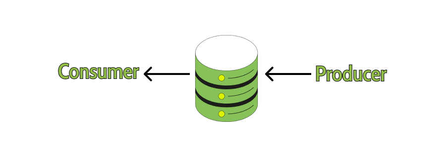

# Android-Preparation

## Core building blocks of Android
- Activity
- Fragment
- Views
- Intent
- Service
- Content Providers
- Android Manifest

## Activity
#### Activity is a class that represents a single screen.
#### Activity has its own lifecycle method mentioned below.
- onCreate() - Called when an activity is first created.
- onStart() - Called when an activity becomes visible to the user.
- onResume() - Called when an activity starts interacting with the user.
- onPause() - Called when an activity is not visible to the user.
- onStop() - Called when an activity is no longer visible to the user.
- onRestart() - Called when an activity stopped, prior to restart.
- onDestroy() - Called when an activity is destroyed.

## Flow in Kotin
#### Flow is a reactive stream processing library that provides a way to emit and consumes streams of data asynchronously and efficiently.



There are two types of Streams.
#### Hot Stream
Hot Stream produces data no matter consumer is consuming it or not.
#### Cold Stream
Cold Stream produces data only if consumer is consuming at the other side.

#### Flow are by default in Cold nature
Example:
```kotlin
GlobalScope.launch {
    val result = producer()
        result.collect {
            delay(1000)
            Log.d("TAG", "==> collect $it")
        }
}
        
fun producer(): Flow<Int> {
    val list = listOf<Int>(1, 2, 3, 4, 5)
    return flow<Int> {
       list.forEach {
          emit(it)
       }
    }
 }
```
Output:
```kotlin
==> collect 1
==> collect 2
==> collect 3
==> collect 4
==> collect 5
```

#### In case of multiple consumer how the Cold Stream behave?
In case of Cold Stream all the consumers will get the data from starting even if they joined late, but in case of Hot Stream whoever join the late will get the data from that point of state only.

Example:

In the below example we are having two consumers which will consumes data which are emitted from producer function.

```kotlin
//Consumer A
GlobalScope.launch {
    val result = producer()
        result.collect {
            delay(1000)
            Log.d("TAG", "==> collect1 $it")
        }
}

//Consumer B
GlobalScope.launch {
    val result = producer()
    delay(2500)
    result.collect {
        delay(1000)
        Log.d("TAG", "==> collect2 $it")
    }
}
    
fun producer(): Flow<Int> {
    val list = listOf<Int>(1, 2, 3, 4, 5)
    return flow<Int> {
        list.forEach {
            emit(it)
        } 
    }
}
```
In the above example there are two consumers Consumer A and Consumer B. Both are consuming data produced from producer function, but Consumer B has started consuming late by 2.5 seconds still Consumer B will get data from initial state.

Below is the output:
```kotlin
==> collect1 1
==> collect1 2
==> collect1 3
==> collect2 1
==> collect1 4
==> collect2 2
==> collect1 5
==> collect2 3
==> collect2 4
==> collect2 5
```

#### How to cancel flow?
Flow are cancellable by default.
```kotlin
val job=scope.launch{ flow.cancellable().collect{ }}
job.cancel()
```
cancellable() will ensure the flow is terminated before new items are emitted to collect {}.  if job is cancelled though flow builder then all its implementation are cancellable() by default.

#### Events in flow?
##### onStart() :
onStart(){} blocks will gets executed before consuming of any item at the start.
##### onCompletion()
onCompletion(){} blocks will gets executed after all the items are consumed.
##### onEach()
onEach(){} blocks will gets executed before each item is about to emit.

Example:
```kotlin
GlobalScope.launch {
            val result = producer()
            result.onStart {
                Log.d("TAG", "==> on start")
            }.onCompletion {
                Log.d("TAG", "==> on completion")
            }.onEach {
                Log.d("TAG", "==> about to emit $it")
            }.collect {
                delay(1000)
                Log.d("TAG", "==> collect $it")
            }
}

fun producer(): Flow<Int> {
        val list = listOf<Int>(1, 2, 3, 4, 5)
        return flow<Int> {
            list.forEach {
                emit(it)
            }
        }
}
```
Output:
```kotlin
==> on start
==> about to emit 1
==> collect 1
==> about to emit 2
==> collect 2
==> about to emit 3
==> collect 3
==> about to emit 4
==> collect 4
==> about to emit 5
==> collect 5
==> on completion
```


